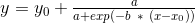

## The mathematics of predictive analytics applied to viral growth in social media   
Speaker: Alain Chesnais, Chief Scientist - Trend Spotter    
Location: SAS Institute     
Time: 6:00pm    

Often times predicting viral conent before they become viral is advantagous to organizations and companies. Everyday, over 500 million posts are published on Twitter and over 4.5 billion piece of content is shared via Facebook. In addition to the vast amount of data, Twitter and Facebook support free API's that enables access to these (anonymised) content.      
Some other tools include: Twitter Track, Twitter Search, GNIP for Twitter and Datasift for Facebook.

While data is readily available, we need mathematical models to help us derive information from this data. When it comes to growth, viral content spread very similarly to any biological virus and that can be described by a Sigmoid Function:     
             

The challenge doesn't end at curve fitting, we need to decide on this opportune window where *enough* data has been observed. Note that if we wait too long, our predictions wont be any relevant. 

### Information Velocity
Based on case studies, tweets that include a URL are more likely to include a noteworthy and potentially viral content. Chasing down url's is a job in itself esp. when dealing with aliases. One way to measure whether a url leads to viral content is to measure its information velocity and the probability:

*V(url) / V(stream).*     

**V(url)** is the number of mentions for the given url per second and **V(stream)** is the number of tweets per second in the subject matter. It's important to narrow down the firehose of tweets to the subject matter of interest or otherwise, we're allowing costly and unnecessary noise into analysis. Regex is usually a great solution.     

Although ranking url's by this probability in a decreasing order works, this method reveals the viral content rather late. In fact, it favors the url's whose velocities are at inflexion point. And yes, as Kinematics suggests we need to move one order higher: acceleration.     

     

Studying the url's with highest acceleration has proved very promising as predictor of future velocity. This method also has the advantage that we can predict a url's future velocity.  

### Refinements
1) Incorporating social meta data such as number of followers/friends.    
2) Incorporating url half life: the time it takes for half of the total shares of a url to take place on a social network.    
3) Understanding the characteristics of the social media and it's underlying algorithms.     
4) Finding the influencers: assigning a velocity to each user to determine who is most influential.     
5) Best Hashtag: similar approach to decide which hashtags will be picked up the quickest.    
6) Avoid curve fitting altogether: Using AI (CNN) to treat each curve as an image and graphically determine which one is showing the closest fit.     
7) Applying a hybrid of the aforementioned methods: weighted velocities. Time has shown to be a reliable weight: the earliest the higher weight.     

### Q/A:
- Social Media bears the trailing trend in Finance.       
- [StockTwits](https://stocktwits.com/) is a twitter-like app dedicated to sharing stock market blurbs.    

## References
1) [Trend Spotter, the company](http://trendspottr.com/)
2) [Original talk slides](http://VisualTransitions.com/PredictiveAnalytics/)
